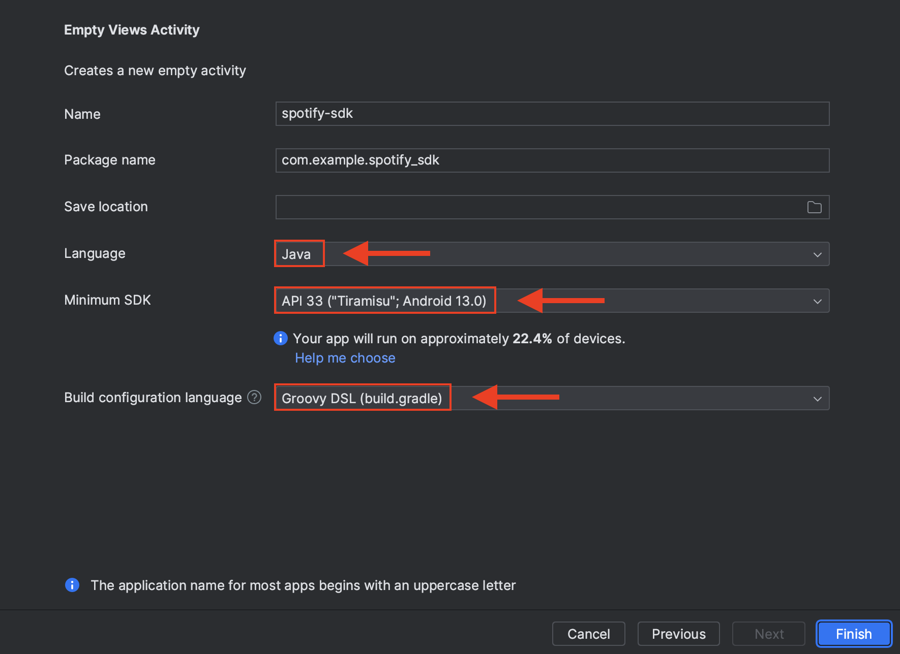
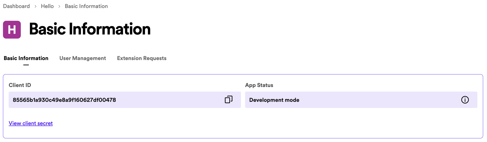
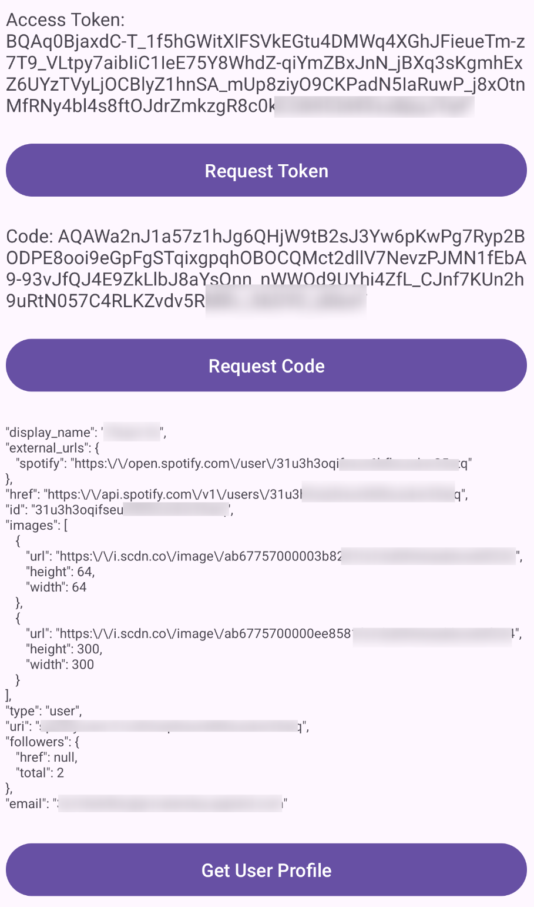
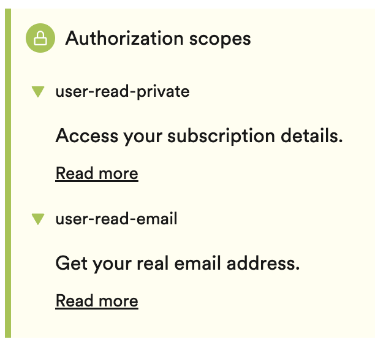
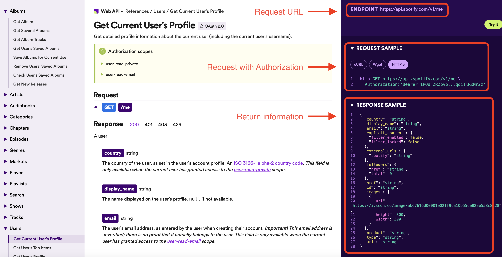
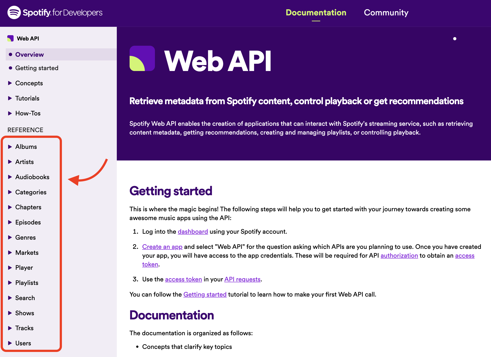
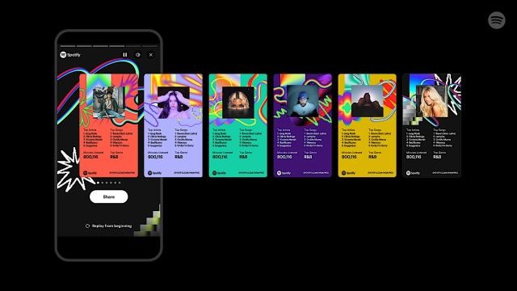

# Android Spotify SDK Tutorial

## 1. Make a new project

To make your new project, get started by creating an empty views activity using `Java` and `Groovy DSL` as the build configuration language.

We highly recommend using `API 33 ("Tiramisu")` to avoid dependency issues and to get the best support from TA team.



## 2. Setting up your Gradle Files

To integrate the Spotify API into your Android project, we need to integrate the following external dependencies into your Gradle file.

```gradle
dependencies {
    ...
    implementation 'com.spotify.android:auth:2.1.1'
    implementation 'com.squareup.okhttp3:okhttp:4.9.3'
}
```

The Spotify Auth package is the official method of interfacing with the Spotify API on Android and removes a lot of the complexity in authenticating requests. The `OkHttp package` simplifies making requests to the API.

We now need to configure the `manifestPlaceholders` so that the redirect URI for Spotify Authentication works properly. **The `redirectSchemeName` should be the name of your Android package!**

```gradle
manifestPlaceholders = [redirectSchemeName: "<Insert Name of your package>", redirectHostName: "auth"]
```

After all of this, your Gradle file should look similar to the example below. Make sure to sync your Gradle project before moving on!

```gradle
plugins {
    id 'com.android.application'
}

android {
    namespace 'com.example.spotify_sdk'
    compileSdk 33

    defaultConfig {
        applicationId "com.example.spotify_sdk"
        minSdk 33
        targetSdk 33
        versionCode 1
        versionName "1.0"

        manifestPlaceholders = [redirectSchemeName: "spotify-sdk", redirectHostName: "auth"]

        testInstrumentationRunner "androidx.test.runner.AndroidJUnitRunner"
    }

    buildTypes {
        release {
            minifyEnabled false
            proguardFiles getDefaultProguardFile('proguard-android-optimize.txt'), 'proguard-rules.pro'
        }
    }
    compileOptions {
        sourceCompatibility JavaVersion.VERSION_1_8
        targetCompatibility JavaVersion.VERSION_1_8
    }
}

dependencies {
    implementation 'com.spotify.android:auth:2.1.1'
    implementation 'com.squareup.okhttp3:okhttp:4.9.3'

    implementation 'androidx.appcompat:appcompat:1.6.1'
    implementation 'com.google.android.material:material:1.11.0'
    implementation 'androidx.constraintlayout:constraintlayout:2.1.4'
    testImplementation 'junit:junit:4.13.2'
    androidTestImplementation 'androidx.test.ext:junit:1.1.5'
    androidTestImplementation 'androidx.test.espresso:espresso-core:3.5.1'
}
```

## 3. Register Your App on Spotify for Developers

1. Go to [Spotify for Developer Dashboard](https://developer.spotify.com/dashboard)
2. Click on `Create App` on the top right. On the next screen, fill out some necessary information:
    - `App Name`: Insert your app name
    - `App description`: Describe what your app does
    - `Redirect URIs`: [redirectSchemeName]://[redirectHostName]
        - Check your `manifestPlaceholders`!
        - As seen above, redirectSchemeName = “**spotify-sdk**” and redirectHostName = “**auth**”
        - Therefore, my redirect URI is `spotify-sdk://auth`
    - `APIs used`: select `Android`, `Web Playback SDK`, and `Web API`
3. Read Spotify's Developer Terms of Service and Design Guidelines carefully (😂). Click on “I understand and agree with Spotify's Developer Terms of Service and Design Guidelines”
4. Click `Save` to create your application
5. Click `Setting` to retrieve the `CLIENT-ID` for your application. This is necessary for connecting to the API and will be used in the demo code below



## 4. Create Demo App

### 1. Create Basic Layout

Inside an empty `ConstraintLayout`, we will populate with a Linear Layout containing 3 buttons and 3 TextView for the purposes of showing some basic information such as Token, Code, and User Profile you can get from the API request.

[You can copy the XML layout from here](./activity_main.xml)

### 2. Create Basic Activity

We provide ActivityMain.java file that provides a simple demo of how to interact with the API in Java. We highly recommend factoring any API interfacing functions into a separate class from the activities to avoid coupling issues, but to keep the demo simple we avoiding doing that here.

**Make sure to plug in your Client ID and redirect URI into the Java file before running the demo!**

[You can copy the Java code from here](./MainActivity.java)

### 3. Sample Output

If you are having any issues with the API, please check the "Troubleshotting Tips" section before asking any TAs for help




## API Request Explanation: Fetch User's Profile

### 1. Look at Spotify's documentation for User Profile

[You can view the User profile documentation here](https://developer.spotify.com/documentation/web-api/reference/get-current-users-profile). When attempting to make API requests, the documentation is your greatest tool!

### 1. Obtain Authorization Token

Before making any requests to the Spotify API, you need to obtain an authorization token used to authenticate your requests. However, not all tokens are created equally. You need to specify the scope of the token you want! To figure out what scope you should request, look at the "Authorization scopes" section of a request in the documentation.

Scopes are used to limit access of some parts of the API to tokens without the necessary permissions. Some API calls will require more/less invasive scopes for security reasons! [You can read more about Scopes here.](https://developer.spotify.com/documentation/web-api/concepts/scopes)

[In Spotify’s documentation for the User Profile](https://developer.spotify.com/documentation/web-api/reference/get-current-users-profile), there are 2 scopes we need to consider in the request (picture attached below). We will use `user-read-email` over `user-read-private` since we don’t want to display the subscription details.



Below is how the demo code requested a token of scope `user-read-email`
```java
private AuthorizationRequest getAuthenticationRequest(AuthorizationResponse.Type type) {
       return new AuthorizationRequest.Builder(CLIENT_ID, type, getRedirectUri().toString())
               .setShowDialog(false)
               .setScopes(new String[] { "user-read-email" })
               .setCampaign("your-campaign-token")
               .build();
   }
```

### 2. Get the Endpoint URL and Authorization Header

On the documentation page, locate the "Request with Authorization" section. This section provides details on how to construct a request to retrieve a user's profile.



<br />


The `Request with Authorization` includes 2 parts:

-   Endpoint URL: This is the URL where you send your request to retrieve the user's profile. In this case, it is https://api.spotify.com/v1/me.
-   Authorization Header: **This header includes the authorization token**. It should be formatted as `"Bearer <authorization_token>"`

### 3. Implement the Request in Java

Below is how the demo code combined the `Endpoint URL` and the `Authorization Header` in a Request

```java
// Create a request to get the user profile
        final Request request = new Request.Builder()
                .url("https://api.spotify.com/v1/me")
                .addHeader("Authorization", "Bearer " + mAccessToken)
                .build();
```

## What to do next?

#### 1. Read over the [Spotify Web API](https://developer.spotify.com/documentation/web-api) documentation to get a better sense of the API's capabilities and what information you can request.



#### 2. Think about how to parse and visualize the information from the API

Example:




## Troubleshooting Tips:

### Redirect URI Mismatch

-   If you encounter a "Redirect URI Mismatch" error, make sure that the redirect URI specified in your Spotify Developer Dashboard matches the one in your AndroidManifest.xml file.

### 429 Error Response

-   Spotify's Web API implements rate limits to ensure the reliability of its services and to promote responsible usage among third-party developers. The rate limit is calculated based on the number of API calls made by an application within a rolling 30-second window.

-   When an application surpasses Spotify's rate limit, it receives a 429 error response from the Web API. This indicates that the application has reached its rate limit and needs to throttle its requests.

-   For more details about rate limits and strategies to overcome the error, please review [Spotify Rate Limit](https://developer.spotify.com/documentation/web-api/concepts/rate-limits)
