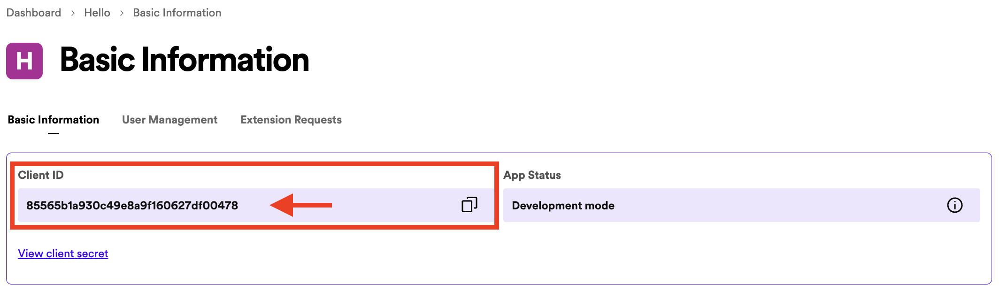

# Android Spotify SDK Tutorial

## 1. Make a new project

To make your new project, get started by creating an empty views activity using Java and Groovy DSL as the build configuration language.

We recommend to use `Minimum SDK API 33` and build with `Groovy DSL` to get the best support from TA teams.


## 2. Setting up your Gradle Files

To integrate the Spotify API into your Android project, we need to integrate the following external dependencies into your Gradle file.

```gradle
dependencies {
    ...
    implementation 'com.spotify.android:auth:2.1.1'
    implementation 'com.squareup.okhttp3:okhttp:4.9.3'
}
```

The Spotify Auth package is the official method of interfacing with the Spotify API on Android and removes a lot of the complexity in authenticating requests. The OkHttp package simplifies making requests to the API.

We now need to configure the manifestPlaceholders so that the redirect URI for Spotify Authentication works properly. The redirectSchemeName should be the name of your Android package!

```gradle
manifestPlaceholders = [redirectSchemeName: "spotify-sdk", redirectHostName: "auth"]
```

After all of this, your Gradle file should look similar to the screenshot below. Make sure to sync your Gradle project before moving on!

```gradle
plugins {
    id 'com.android.application'
}

android {
    namespace 'com.example.spotify_sdk'
    compileSdk 33

    defaultConfig {
        applicationId "com.example.spotify_sdk"
        minSdk 33
        targetSdk 33
        versionCode 1
        versionName "1.0"

        manifestPlaceholders = [redirectSchemeName: "spotify-sdk", redirectHostName: "auth"]

        testInstrumentationRunner "androidx.test.runner.AndroidJUnitRunner"
    }

    buildTypes {
        release {
            minifyEnabled false
            proguardFiles getDefaultProguardFile('proguard-android-optimize.txt'), 'proguard-rules.pro'
        }
    }
    compileOptions {
        sourceCompatibility JavaVersion.VERSION_1_8
        targetCompatibility JavaVersion.VERSION_1_8
    }
}

dependencies {
    implementation 'com.spotify.android:auth:2.1.1'
    implementation 'com.squareup.okhttp3:okhttp:4.9.3'

    implementation 'androidx.appcompat:appcompat:1.6.1'
    implementation 'com.google.android.material:material:1.11.0'
    implementation 'androidx.constraintlayout:constraintlayout:2.1.4'
    testImplementation 'junit:junit:4.13.2'
    androidTestImplementation 'androidx.test.ext:junit:1.1.5'
    androidTestImplementation 'androidx.test.espresso:espresso-core:3.5.1'
}
```

## 3. Register Your App on Spotify for Developers

1. Go to [Spotify for Developer Dashboard](https://developer.spotify.com/dashboard)
2. Click on `Create App` on the top right. On the next screen, fill out some necessary information:
    - `App Name`: Insert your app name
    - `App description`: Describe what your app does
    - `Redirect URIs`: [redirectSchemeName]://[redirectHostName]
        - Check your `manifestPlaceholders`!
        - As seen above, redirectSchemeName = “**spotify-sdk**” and redirectHostName = “**auth**”
        - Therefore, my redirect URI is `spotify-sdk://auth`
    - `APIs used`: select `Android`, `Web Playback SDK`, and `Web API`
3. Read Spotify's Developer Terms of Service and Design Guidelines carefully (😂). Click on “I understand and agree with Spotify's Developer Terms of Service and Design Guidelines”
4. Click `Save` to create your application
5. Click `Setting` to retrieve the `CLIENT-ID` for your application. This is necessary for connecting to the API and will be used in the demo code below



## 4. Create Basic Application

### 1. Create Basic Layout

Inside an empty `ConstraintLayout`, we will populate with a Linear Layout containing 3 buttons and 3 TextView for the purposes of showing some basic information such as Token, Code, and User Profile you can get from the API request.

[You can copy the XML layout from here.](./activity_main.xml)

### 2. Create Basic Activity

The Sample ActivityMain.java file which is compatible with the given layout above:

[You can copy the Java code from here](./MainActivity.java)

## The result


## Important

There is a method in `MainActivity.java` allowing you to add scopes into request.

```java
private AuthorizationRequest getAuthenticationRequest(AuthorizationResponse.Type type) {
       return new AuthorizationRequest.Builder(CLIENT_ID, type, getRedirectUri().toString())
               .setShowDialog(false)
               .setScopes(new String[] { "user-read-email" })
               .setCampaign("your-campaign-token")
               .build();
   }
```

### What are Spotify Scopes?

Spotify Scopes are used to limit access of some parts of the API to tokens without the necessary permissions. Some API calls will require more/less invasive scopes for security reasons! [You can read more about Scopes here.](https://developer.spotify.com/documentation/web-api/concepts/scopes)

[In Spotify’s documentation for the User Profile](https://developer.spotify.com/documentation/web-api/reference/get-current-users-profile), there are 2 scopes we need to consider in the request. However, we can discard `user-read-private` since we don’t want to display the subscription details.

In our example, we will retrieve the current user’s information. We use `user-read-email` scope to request the current user’s information.


